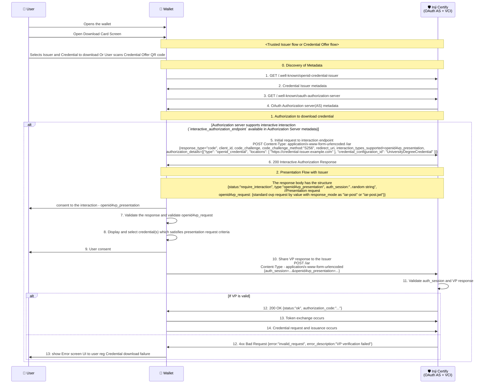
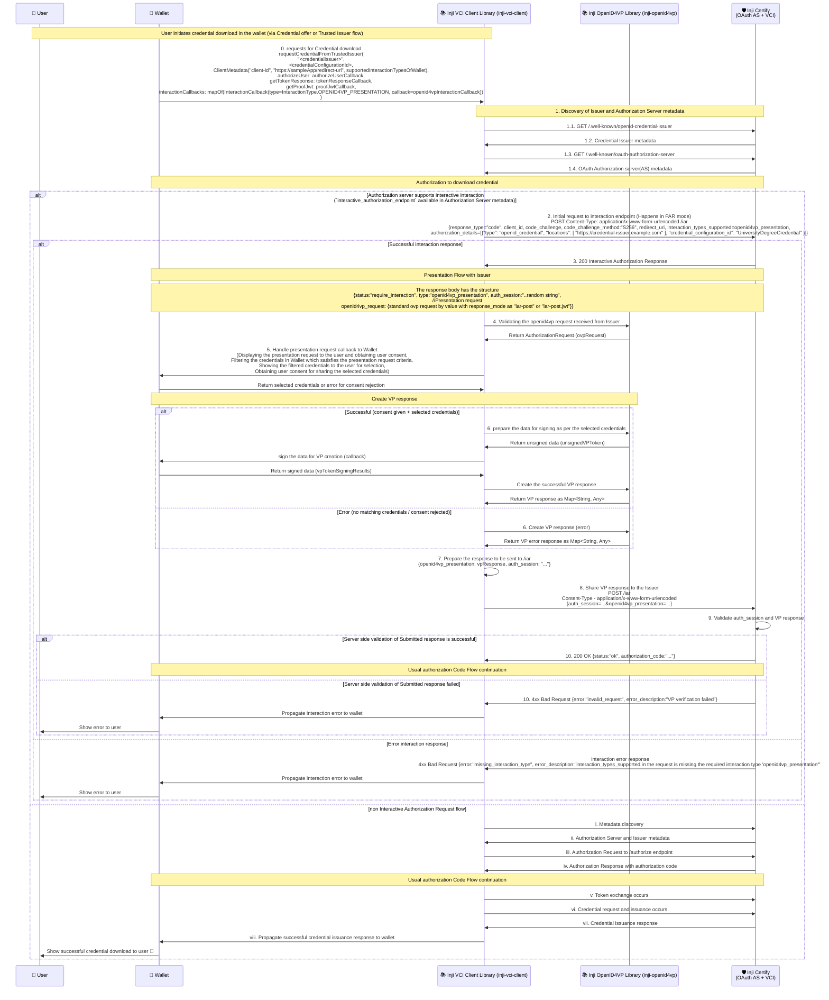
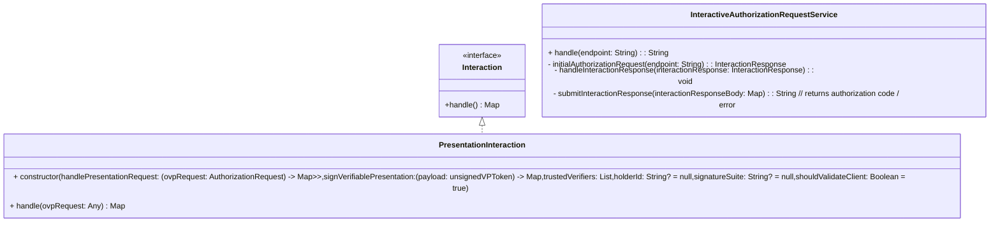

# Presentation During Issuance

When issuing credentials to a user, authentication or authorization is often required. The most common factor used is an OTP. However, using OTPs means the user must recall their identifier each time they access their credential. To simplify this, the specification allows submitting an existing credential to authorize the user for credential issuance — a process known as Presentation during Issuance.
In essence, it means presenting one credential to obtain another.

Example use cases:

- To issue a Student ID Credential, the user presents an Enrollment Credential issued by the educational institution.
- To issue a Health Insurance Credential, the user presents an Identity Credential issued by a government authority.

This document focuses on the tech design to support presentations during the issuance process, particularly in scenarios where the issuer requires a presentation to be made before issuing a credential.

## Clarifications

- The OVP request received is no different from current OVP request structure followed in Wallet. [Draft 23 OpenID4VP specification using DIF presentation exchange](https://openid.net/specs/openid-4-verifiable-presentations-1_0-ID3.html#name-dif-presentation-exchange-2).
- The VP response created is also similar to the current VP response structure followed in Wallet. [Draft 23 VP response (Presentation Exchange)](https://openid.net/specs/openid-4-verifiable-presentations-1_0-ID3.html#name-examples-presentation-excha).
- Wallet supports for `openid4vp_presentation` interaction type only. Other interaction types like `redirect_to_web` will be supported in the future.

### Future scope

- `redirect_to_web` interaction type support during issuance.

## Pre-requisites

- The Issuer supporting the Interactive Authorization Request Endpoint as per the specification.

## Overall Flow diagram

### Actors involved

1. **User**: The individual requesting the credential.
2. **Wallet - Inji Wallet**: The digital wallet application used by the user to manage credentials.
3. **Issuer - Inji Certify (OAuth AS + VCI)**: The entity responsible for issuing the credential, which also acts as an OAuth Authorization Server and Verifiable Credential Issuer.

### Sequence of interactions between entities

## Sequence of interactions between entities via inji-\* Libraries

### Actors involved

1. **User**: The individual requesting the credential.
2. **Wallet - Inji Wallet**: The digital wallet application used by the user to manage credentials.
3. **Issuer - Inji Certify (OAuth AS + VCI)**: The entity responsible for issuing the credential, which also acts as an OAuth Authorization Server and Verifiable Credential Issuer.
4. **Inji VCI Client Library**: The library used by the wallet to handle OpenID for VC issuance. (Download of credential into Wallet)
5. **Inji OpenID4VP Library**: The library used by the wallet to handle OpenID for Verifiable Presentations. (Wallet presenting of the credential to a Verifier)

#### Notes

- In Step 0, why is it interactionCallbacks rather than just presentationRequestCallback?
  - Because in the future, there can be other interaction types (eg - `redirect_to_web` or any custom interaction) supported during issuance as well. Hence, to keep it extensible, we have designed it this way.
- In Step 4, why is ovp request validation or any other processing propogated to Wallet rather than being handled in inji-openid4vp library?
  - Because the Wallet is responsible for user interactions, including displaying requests and obtaining user consent. Hence, the Wallet needs to validate the request and process it accordingly.
  - This also allows the Wallet to have control over how it wants to handle the presentation request and which library to use for VP response creation.
- After step 5, why is it Create VP response rather than send VP response
  - Because in this flow, the VP response needs to be sent to the Issuer (/iar) which is known to vci client library.
  - The method `sendAuthorizationResponseToVerifier` is designed to send the VP response directly to the verifier endpoint, which is not applicable in this case.
  - check below point for more clarity on why vci-client needs only the OVP response.
- In Step 8, why is vci client library responsible for sharing VP response to issuer rather than inji-openid4vp library?
  - Because the vci client library is responsible for handling the overall issuance flow, including interactions with the issuer.
  - The inji-openid4vp library is focused on handling OpenID for Verifiable Presentations, including creating VP responses, but not managing the entire issuance process.
  - Also, There is a mandation to add authSession to the request which is more specific to issuance flow and not related to openid4vp.
  - The VP response submission body of OVP flow - {vp_token:..., presentation_submission:...} is wrapped inside but in PDI flow {auth_session:..., openid4vp_presentation:{vp_token:..., presentation_submission:...}} it differs. To handle this wrapping and addition of auth_session, it is better to keep this logic in vci client library to have more control.

#### Implementation details - Presentation Interaction

**Class diagram for Presentation Interaction**

**Responsibilities - Presentation Interaction**

| Step                                                         | Task                                                                                  | Called by       | Responsibility handled by | Notes                                                                                                                                                                                                                                                                                                                                                                                                                                                                                                                    |
|--------------------------------------------------------------|---------------------------------------------------------------------------------------|-----------------|---------------------------|--------------------------------------------------------------------------------------------------------------------------------------------------------------------------------------------------------------------------------------------------------------------------------------------------------------------------------------------------------------------------------------------------------------------------------------------------------------------------------------------------------------------------|
| 1                                                            | Validating the openid4vp request received from Issuer                                 | inji-vci-client | inji-openid4vp            | - vci-client communicates with openid4vp library to validate the request.  - Method used: authenticateVerifier (openid4vp) - sample: `authenticateVerifer(urlEncodedAuthorizationRequest = null,authorizationRequest = ovpRequest,trustedVerifiers = trustedVerifiers,shouldValidateClient = true): AuthorizationRequest`                                                                                                                                                                                        |
| 2                                                            | Displaying the presentation request to the user and obtaining user consent            | inji-vci-client | wallet (callback)         | - inji-vci-client does a callback to wallet passing the VP request and getting the matching credentials selected by user (selectedCredentials) in response. - The user consent are all handled by the callback. Basically step no 2,3,4,5 are handled and the matching credentials are returned or error for consent rejection is thrown - Method used: handlePresentationRequest (wallet) - sample: `handlePresentationRequest(ovpRequest: AuthorizationRequest) : Map<String, Map<FormatType, List<Any>>>` |
| 3                                                            | Filtering the credentials in Wallet which satisfies the presentation request criteria | -               | wallet (callback)         | <same as before>                                                                                                                                                                                                                                                                                                                                                                                                                                                                                                         |
| 4                                                            | Showing the filtered credentials to the user for selection                            | -               | wallet (callback)         | <same as before>                                                                                                                                                                                                                                                                                                                                                                                                                                                                                                         |
| 5                                                            | Obtaining user consent for sharing the selected credentials                           | -               | wallet (callback)         | <same as before>                                                                                                                                                                                                                                                                                                                                                                                                                                                                                                         |
| 6 (success - matching credentials available + consent given) | Creating the VP response based on selected credentials                                |                 |                           |                                                                                                                                                                                                                                                                                                                                                                                                                                                                                                                          |
| 6.1                                                          | prepare the data for signing as per the selected credentials                          | inji-vci-client | inji-openid4vp            | - vci-client communicates with openid4vp library with the selected credentials (return of handlePresentationRequest callback) - returns the unsigned data - Method used: constructUnsignedVPToken (openid4vp) - sample: `constructUnsignedVPToken(verifiableCredentials = selectedCredentials, holderId = holderId, signatureSuite = signatureSuite) :  Map<FormatType, UnsignedVPToken>`                                                                                                                    |
| 6.2                                                          | sign the data for VP creation                                                         | inji-vci-client | wallet (callback)         | - vci-client does a callback to wallet with the unsigned data (unsignedVPToken) to get the signed data (vpTokenSigningResults) - Method: signVerifiablePresentation(payload: unsignedVPToken) : Map<FormatType, VPTokenSigningResult> - sample: `signVerifiablePresentation(payload = unsignedVPToken): Map<FormatType, VPTokenSigningResult {//sign the data // return signed data}`                                                                                                                            |
| 6.3                                                          | Create the successful VP response                                                     | inji-vci-client | inji-openid4vp            | - vci-client communicates with openid4vp library to get the VP response - Method: constructVPResponse(vpTokenSigningResults: Map<FormatType, VPTokenSigningResult>) : Map<String,Any>      - sample return: {vp_token: "...", presentation_submission: "..."} or {response: "..."} (encrypted - iar-post.jwt)                                                                                                                                                                                                    |
| 6 (failure - no matching credentials / no consent)           | Creating VP response based on error                                                   |                 |                           |                                                                                                                                                                                                                                                                                                                                                                                                                                                                                                                          |
| 6.1                                                          | Create the error VP response                                                          | inji-vci-client | inji-openid4vp            | - vci-client communicates with openid4vp library to get the error VP response - Method: constructErrorInfo(exception: Exception): Map<String, Any> sample return : {error: "access_denied", error_description: "user rejected consent"}                                                                                                                                                                                                                                                                          |
| 7                                                            | Prepare the response to be sent to /iar                                               | N/A             | inji-vci-client           | - Prepare the data for response body of /iar - returns map of {openid4vp_response: <vp error / success response>}                                                                                                                                                                                                                                                                                                                                                                                                    |
| 8                                                            | Sharing the VP response to Issuer                                                     | N/A             | inji-vci-client           | - Create the final response body for /iar request by attaching "auth_session" to the response body input provided by the specific interaction  (Note: The above steps are handled in PresentationInteraction whereas this step will be handled by InteractiveAuthorizationRequestService)                                                                                                                                                                                                                            |

Note: 
- Steps 1 to 7 are handled in the `PresentationInteraction` class of the `inji-vci-client` library, while step 8 is managed in the `InteractiveAuthorizationRequestService` class.
- This separation exists because step 8 is common across all interaction types, whereas steps 1 to 7 are specific to the presentation interaction type.
- Specific interaction classes provide the final response body for the `/iar` endpoint based on the interaction type only. For example:
  - In the presentation interaction type, the response body includes `auth_session` and `openid4vp_presentation`.
  - `openid4vp_presentation` is generated by the `PresentationInteraction` class, while `auth_session` is added by the `InteractiveAuthorizationRequestService` class, as it is common to all interaction types.
- In step 1, why is authenticateVerifier called with urlEncodedAuthorizationRequest = null and authorizationRequest = ovpRequest?
  - Because in this flow, the openid4vp request is received by value (as JSON and not as a URL). Hence, we pass it as authorizationRequest.

#### Changes summary

1. Inji VCI Client Library
   - Add support for client metadata to accept supported interaction types of Wallet. (interactionTypesSupported field)
   - Update requestCredentialFromTrustedIssuer and requestCredentialFromOffer methods to accept interactionCallbacks map to handle different interaction types during issuance.
   - Implement logic to handle openid4vp_presentation interaction type, including invoking the appropriate callback in the Wallet.
   - Add logic to share VP response to Issuer's /iar endpoint after receiving it from Wallet.
2. Inji OpenID4VP Library
   - Add support to validate openid4vp request with response_mode as iar-post or iar-post.jwt by skipping response_uri check.
   - Add support to create VP response for openid4vp request with response_mode as iar-post or iar-post.jwt.
   - Add method `constructVPResponse` to create VP response and return it as Map<String, Any> to Wallet.
3. Inji Wallet

- Implement the openid4vp interaction callback to handle the presentation request, display it to the user, and obtain user consent.
- Use inji-openid4vp library to process the openid4vp request and create the VP response.
- Handle error scenarios and propagate errors to the user appropriately.
- Integrate with the updated inji-vci-client library to support the new interaction flow during credential issuance.

## References

- [OpenID for Verifiable Credentials Issuance 1.1 - Interactive Authorization Request Endpoint](https://openid.github.io/OpenID4VCI/openid-4-verifiable-credential-issuance-1_1-wg-draft.html#name-interactive-authorization-e)
- [OpenID for Verifiable Presentations - Draft 23](https://openid.github.io/openid4vp/draft-23.html)
- [RFC 9126 - Pushed Authorization Requests (PAR)](https://datatracker.ietf.org/doc/html/rfc9126)
- [Spike card](https://mosip.atlassian.net/browse/INJIMOB-3601)
